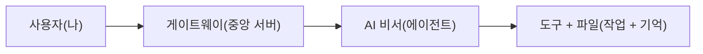

# 아주 쉬운 공부 가이드

이 문서는 누구나 이해할 수 있게 아주 쉽게 설명한 공부 가이드다.

> 더 자세한 용어 설명은 [README의 용어 해설](README.md#용어-해설)을 참고하자.

## 0. 이 시스템을 한마디로 말하면
- Clawdbot은 **AI 비서**다.
- AI 비서는 **게이트웨이(중앙 관리 서버)**라는 문을 통해 말을 듣고, **도구**로 일을 한다.
- AI 비서가 기억해야 할 것은 **폴더 안 파일**에 적어 둔다.

## 1. 가장 중요한 그림 한 장
```
사용자(나) → 문(게이트웨이) → AI 비서(에이전트)
                                 |
                                 v
                           도구와 파일(작업, 기억)
```

또 하나의 쉬운 그림:
```
┌─────────┐   ┌──────────────┐   ┌──────────┐
│  사용자  │→ │  게이트웨이    │→ │  AI 비서  │
│  (나)   │   │ (중앙 서버)   │   │(에이전트) │
└─────────┘   └──────────────┘   └─────┬─────┘
                                       │
                                       v
                                ┌─────────────┐
                                │ 도구 + 파일 │
                                │(작업 + 기억)│
                                └─────────────┘
```

Mermaid 그림(흐름):


## 2. 핵심 용어를 쉽게 알아보자
| 용어 | 쉬운 설명 |
|------|-----------|
| **게이트웨이** | 문이다. 모든 메시지가 이 문으로 들어온다. 건물의 정문과 같다. |
| **에이전트** | AI 비서다. 생각하고 대답한다. |
| **세션** | 대화 한 묶음이다. 같은 채팅방에서 이어지는 대화라고 생각하자. |
| **워크스페이스** | AI 비서의 책상이다. 설정 파일과 기억이 있는 장소다. |
| **도구** | AI 비서의 손이다. 파일 읽기, 명령 실행 같은 일들을 한다. |
| **메모리 파일** | AI 비서가 잊지 않도록 적어 두는 공책이다. |
| **스킬** | AI 비서에게 주는 능력 꾸러미다. 여러 도구를 묶어 놓은 것. |
| **훅** | 특정 시점에 자동으로 실행되는 기능. 알람처럼 조건이 되면 작동한다. |
| **샌드박스** | 안전 구역이다. 위험한 작업을 격리된 공간에서 실행한다. |

## 3. 공부 순서
아래 순서대로 보면 아주 쉽다.

### 1) 전체 그림 먼저 보기
- 문(게이트웨이)이 있고, AI 비서(에이전트)가 있고, 도구와 파일이 있다.
- 이 그림이 머리에 들어오면 반은 끝난 것이다.

### 2) 대화는 세션이라는 상자에 담긴다
- 같은 대화는 같은 상자에 들어간다.
- 새로 시작하고 싶으면 새 상자를 만든다.

### 3) AI 비서는 파일을 읽고 기억한다
- 중요한 건 파일에 적는다.
- 파일이 AI 비서의 기억이다. 대화가 끝나도 파일은 남아있다.

### 4) AI 비서는 도구로 일을 한다
- 도구는 "손"이다.
- 손을 쓸 때는 안전 규칙이 있다 (위험한 일은 승인을 받아야 한다).

## 4. 집에서 하는 쉬운 연습
1. 종이에 "게이트웨이, 에이전트, 세션, 워크스페이스, 도구"를 적는다.
2. 각각을 한 문장으로 설명해 본다.
3. 그림을 그리고 다른 사람에게 설명해 본다.

## 5. 한 줄 요약
- **문(게이트웨이)**으로 들어오고, **AI 비서(에이전트)**가 생각하고, **도구(손)**로 일을 한다.
- **대화 상자(세션)**에 이야기들이 모이고, **파일**에 중요한 것을 적는다.

## 다음에 더 공부할 것
- AI 비서가 생각하는 방식 → [Part 3](part-3-reasoning-planning.md) 참고
- 도구가 안전하게 쓰이는 규칙 → [Part 6](part-6-observability-safety-extensibility.md) 참고
- 여러 AI 비서가 함께 일하는 방법 → [Part 5](part-5-control-flow-orchestration.md) 참고
