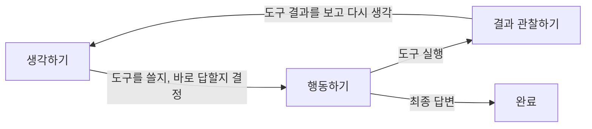

# Part 3. 추론과 계획 수립

이 문서는 Clawdbot의 AI 추론 과정과 계획 수립 방식을 학습 관점에서 분석한다.

> 용어가 어렵다면 [README의 용어 해설](README.md#용어-해설)을 먼저 읽어보자.

## 한눈에 보기
- Clawdbot은 별도의 "계획 수립 모듈"보다는, **에이전트 반복 루프**(생각 → 행동 → 관찰을 반복)와 **생각 수준 제어**에 집중한다.
- 생각 수준은 `off(끔)/minimal(최소)/low(낮음)/medium(중간)/high(높음)/xhigh(최고)`로 나뉘며, AI 모델이 지원하는 범위에 따라 제한된다.
- 실행 중 도구 호출이 발생하면, **도구 결과 전달과 대기 중인 메시지 처리**가 반복 루프의 핵심 분기점이 된다.

## 시각화: 생각 → 행동 → 관찰 반복 루프


## 상세 분석
### 1) 생각 수준과 표시 방식
- 입력된 생각 수준 문자열을 내부의 정해진 선택지 목록으로 통일(정규화)해서 변환한다.
- `xhigh(최고)` 수준은 특정 AI 모델만 지원한다. 지원하지 않는 모델에서는 자동으로 낮춰지거나 오류로 처리된다.
- 생각 과정의 표시는 `off(숨김)/on(표시)/stream(실시간 표시)`로 제어되며, 채널에 따라 덩어리 단위 전송 또는 조각 단위 실시간 전송으로 전달된다.

### 2) 계획 수립의 방식
- 코드 구조상 별도의 "계획 수립 전담 모듈"이 존재하지 않는다. 대신, **AI에게 주는 지시문(시스템 프롬프트) + 실행 시 힌트 + AI 모델 자체의 추론 능력**에 의존하는 형태다.
- 이 설계는 구현이 단순하다는 장점이 있지만, 계획 과정을 외부에서 세밀하게 제어하기는 어렵다.

### 3) 에이전트 반복 루프의 핵심 분기점
- 에이전트 루프는 하나의 대화(세션) 단위로 순서대로 처리되며, 다음과 같은 흐름이 발생한다:
  - 입력 수집 → 맥락 정보 조립 → AI 추론 → 도구 실행 → 결과 전송 → 대화 기록 저장
- 도구를 실행한 뒤 **대기 중인 새 메시지가 있으면**, 남은 도구 실행을 중단하고 새 메시지를 다음 차례에 처리한다.
- 대화가 너무 길어져 요약(컴팩션)이 필요하면, 이전 내용을 요약한 뒤 다시 시도한다.

### 4) 실시간 전송과 응답 방식
- AI의 응답 조각은 `assistant`(비서 응답) 채널로 실시간 전송된다.
- 덩어리 단위 전송은 문장이나 단락이 끝나는 경계를 기준으로 부분 응답을 보낸다.
- 도구 실행 상태는 `tool`(도구) 채널로 표시되어, 관리 화면이나 로그에서 진행 상황을 확인할 수 있다.

## 핵심 동작 흐름 설명
```
내장 AI 엔진 실행:
  대화별 대기줄에 등록
  시스템 지시문 + 도구 목록 구성
  반복 실행:
    AI가 응답 조각 또는 도구 호출을 생성
    만약 도구 호출이면:
      도구 실행
      결과를 실시간 전송
      만약 대기 중인 새 메시지가 있으면:
        남은 도구 호출 건너뛰기
        새 메시지를 다음 차례에 처리
  만약 대화 요약(컴팩션)이 필요하면:
    이전 맥락을 요약
    요약된 맥락으로 다시 시도
```

## 학습자가 얻어야 할 포인트
- Clawdbot은 **별도 계획 모듈보다 반복 루프 제어와 실시간 전송에 집중**한다.
- 생각 수준(Thinking/Reasoning)은 AI 모델의 지원 범위와 채널 설정에 따라 실제 출력이 달라진다.
- 도구 실행 후 대기 메시지 확인은 **반복 루프의 핵심 분기 로직**이며, 대화 중단과 재진입을 결정한다.
- 대화 요약(컴팩션)은 긴 대화에서 필연적이며, "다시 시도"는 오류가 아니라 정상 흐름의 일부다.

## 학습 관점에서 중요한 파일
- `docs/concepts/agent-loop.md`
- `src/auto-reply/thinking.ts`
- `src/agents/pi-embedded-runner/run.ts`
- `src/agents/pi-embedded-runner/run/attempt.ts`

## 다음 Part에서 다룰 내용
- Part 4에서는 **도구, 기억, 맥락 관리**: 도구 실행 방식, 파일 기반 기억, 맥락 정보 관리 흐름을 분석한다.
